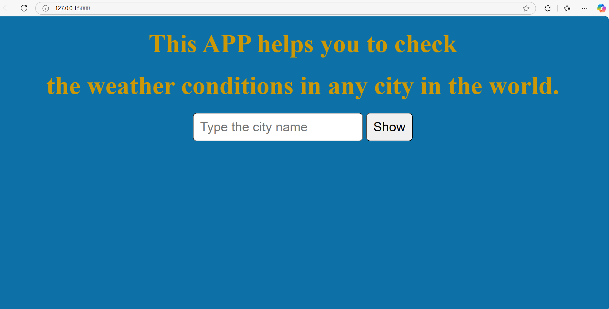
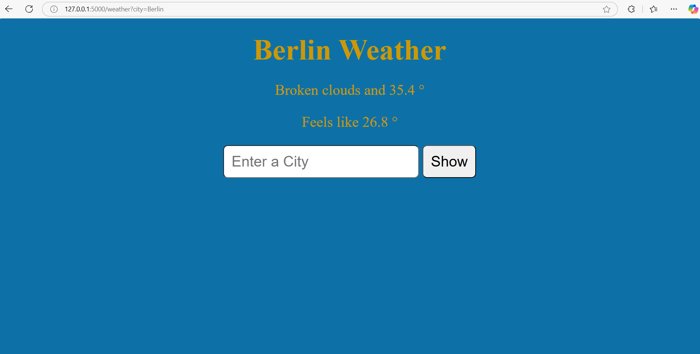
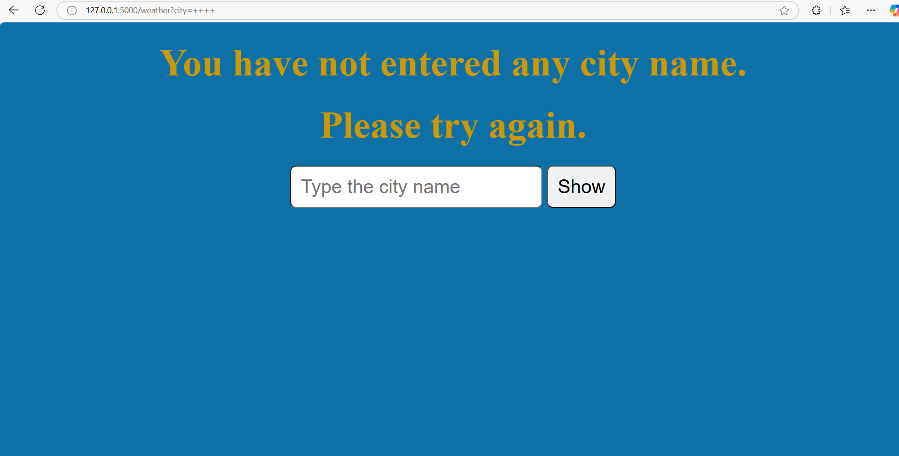
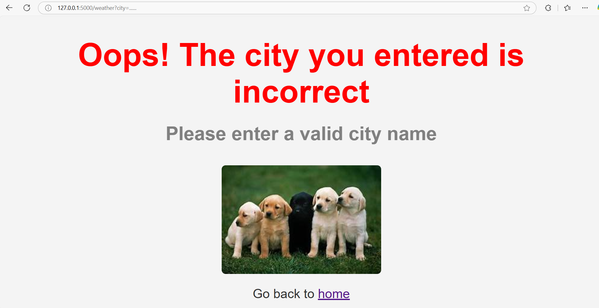

# Flask Weather App

## Project Overview
This is a simple Flask web application that allows users to input a city name and fetch the current weather for that location using an external weather API. If the user provides an invalid or incorrect city name, the app notifies them to input a valid city.

## Features
- Input a city name to retrieve real-time weather data, including:
  - Temperature
  - Weather condition (e.g., clear, cloudy, rain)
  - "Feels like" temperature
- Displays an error message if the city name is invalid or not found.

## Demo
### How It Works:
1. Enter the name of a city in the input field.
2. If the city is valid, the app displays the weather details, including:
   - Temperature
   - Weather condition
   - Feels like temperature
3. If the city is invalid, an error message is displayed.

### Screenshots:
1. **Homepage**: Enter any city to get its weather details.  
   

2. **Weather Display for Berlin (Example)**: Displays weather information for the entered city.  
   

3. **Empty Input**: Displays a message prompting the user to input a city name.  
   

4. **Invalid City Error**: Displays an error for incorrect or non-existent cities.  
   

---

## Technologies Used
- **Flask**: Lightweight web framework for Python.
- **HTML/CSS**: Front-end rendering.
- **OpenWeatherMap API**: Provides real-time weather data.
- **Python**: Backend language for API integration and server logic.

---

## Getting Started

### Prerequisites
Before running the project, ensure you have the following installed:
- **Python 3.x**: Required for running the Flask application.
- **Git**: To clone the repository.
- **Flask**: For running the app locally (without Docker).

### Setup Instructions
1. **Clone the Repository**  
   Clone the project to your local machine:
   ```bash
   git clone https://github.com/yourusername/flask-weather-app.git
   ```

2. **Navigate to the Project Directory**  
   ```bash
   cd flask-weather-app
   ```

3. **Set Up a Virtual Environment** (Recommended)  
   Use a virtual environment to manage dependencies:
   ```bash
   python -m venv venv
   source venv/bin/activate  # On Windows: venv\Scripts\activate
   ```

4. **Install Dependencies**  
   Install the required Python packages:
   ```bash
   pip install -r requirements.txt
   ```

5. **Set Up Your API Key**  
   - Register at [OpenWeatherMap](https://home.openweathermap.org/users/sign_up) to get an API key.
   - Create a `.env` file in the project root:
     ```
     API_KEY=your_openweathermap_api_key
     ```

6. **Run the Application**  
   Start the Flask development server:
   ```bash
   flask run or python server.py
   ```
   By default, the app will be accessible at `http://127.0.0.1:5000/`.

2. Run the container with environment variables:
   ```bash
   docker run -p 5000:5000 --env-file .env flask-weather-app
   ```
   Access the app at `http://localhost:5000`.

---

## Usage
1. Open your browser and go to `http://127.0.0.1:5000/`.
2. Enter a city name and click **Submit**.
3. View the weather details for the entered city.
4. If the city is invalid, an error message will prompt you to enter a valid city.

### Example Cities:
- **Valid City**: `Berlin`, `Paris`, `New York`.
- **Invalid City**: `RandomCity123` (shows an error message).

---

## Error Handling
### Scenarios:
1. **Valid City Input**: Weather details are displayed.
   

2. **Invalid City Input**: Error message is displayed.
   

---

## Project Structure
A basic breakdown of the project files:

```
flask-weather-app/
│
├── static/              # Static files (CSS, JS, Images)
├── templates/           # HTML templates
│   ├── weather.html     # Main weather display page
│   └── city-not-found.html  # Error page for invalid city input
├── app.py               # Main Flask app
├── check_weather.py     # Script to fetch weather data from the API
├── .env                 # API Key storage
├── .gitignore           # Ignored files (includes venv and .env)
├── requirements.txt     # List of dependencies
└── README.md            # Project documentation
```

---

## Dependencies
Listed in `requirements.txt`:
- **Flask**: Web framework.
- **Requests**: For API calls to OpenWeatherMap.
- **python-dotenv**: For environment variable management.

---

## How to Contribute
Contributions are welcome! Follow these steps to contribute:
1. Fork the repository.
2. Create a new branch for your feature/bug fix.
3. Commit your changes and push to your forked repository.
4. Submit a pull request for review.

---

## License
This project is open-source and available under the [MIT License](LICENSE).
